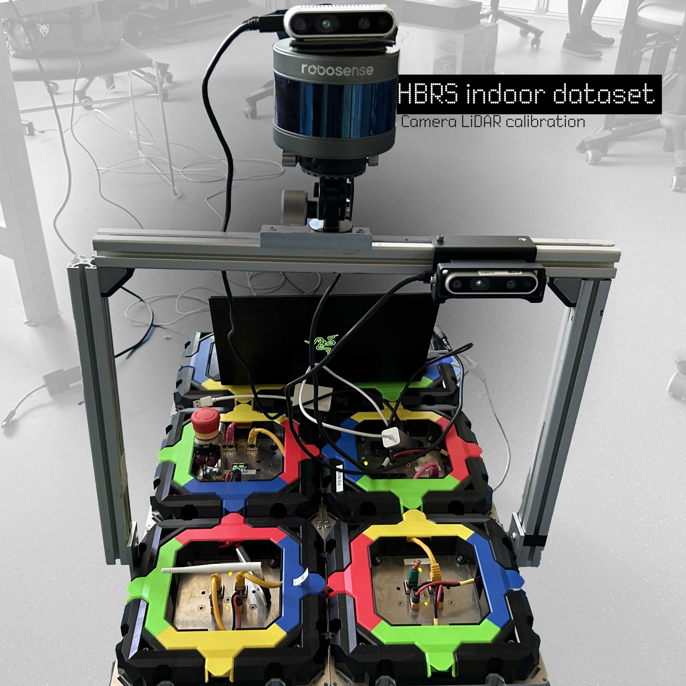

# HBRS Indoor Dataset

  

## Overview

The Hochschule-Bonn-Rhein-Sieg indoor dataset contains images and point clouds acquired in indoor for automatic camera-lidar calibration.
Indoor dataset: contains 10 pairs of images and point clouds.

## Contact Information

Please contact us at bharath.adinarayan@smail.h-brs.de.

